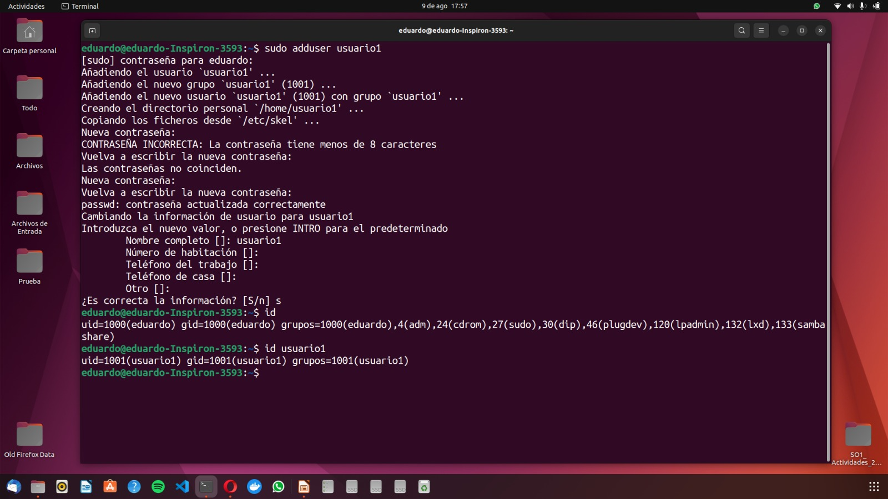
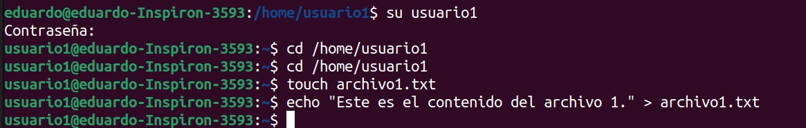

# Creación y permisos para usuarios y grupos

## Crear, consultar y eliminar usuarios

_En esta sección podemos ver que con el comando ***sudo adduser nombreusuario*** ´pdemos crear usuarios en linux, después de esto agregamos una contraseña al usuario y le damos enter a cada uno de los campos que nos solicita después para poder crearlo_
 

_Para poder consultar cada uno de los usuarios podemos hacerlo mediante el comando ***id nombreusuario***_

 

_Para poder eliminar un usuario podemos utilizar el comando ***sudo deluser --remove-home nombreusuario***_

## Gestion de Grupos

_Para poder crear un grupo debemos de correr el siguiente comando ***sudo addgroup nombre_grupo***_

_Para poder agregar al usuario al grupo podemos hacerlo con el siguiente comando ***sudo adduser nombreusuario nombregrupo***_

_Para consultar a que grupo pertenece cada usuario podemos hacerlo mnediante ***groups nombreusuario***_

_Para poder eliminar a un grupo junto a su usuario podemos ejecutar el comando ***sudo delgroup nombregrupo***_

## Gestion de permisos

_Para poder cambiar de usuario ejecutamos el comando ***su nombreusuario*** luego no movemos a la carpeta origen del usuario1, al estar en esta carpeta creamos un archivo mediante ***touch nombredelarchivo.txt*** luedo usamos el comando ***echo "texto dentro del archivo" > nombredelarchivo.txt*** con esto hemos creado un archivo el cual su propietario es el usuario1_

_Creamos un directorio usando el mkdir y nos movemos hacía ese directorio y y usamos el comando ***touch nombredelarchivo.txt*** para poder crearlo_

_Usamos los comandos ***ls -l*** y ***ls -ld*** para poder ver los permisos que tiene de momento los directorios y los archivos_

_Usamos el comando chmod numérico para poder dar los permisos necesarios_

_Usamos el comando chown para poder darle permisos especificos a un archivo_

_Usamos el chmod 750 para cambiar el grupo al que pertenece nuestro directorio_

_Usamos la linea de comando ***cat*** para poder intentar ingresar al contenido del archivo y de igual manera para el directorio y podemos ver que como usuario 2 no tenemos permisos para poder ingresar_

_Por lo ultimo usamos nuevamente el ***ls -l*** y ***ls -ld*** para poder ver especificamente que los permisos solo los tiene el usuario1_

